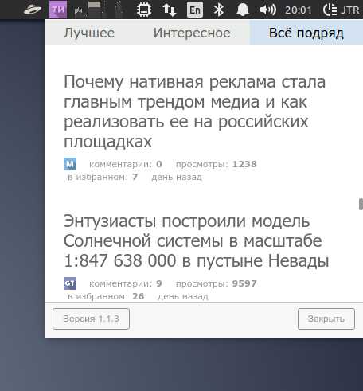

# TM Feed Меню

Висит в трее и показывает ленту новостей с [агрегатора](http://tmfeed.ru/) [Тематических Медиа](https://tmtm.ru),
базирована на [Hacker Menu](https://hackermenu.io/). Внутри [Electron](http://electron.atom.io/) и [Node.js](https://nodejs.org).

Скриншот:


## Установка

Скачать последние билды можно в разделе [releases](https://github.com/JiLiZART/tmfeed-menu/releases). 

## Разработка

Нужен последний билд [node.js](https://nodejs.org/).

```bash
$ npm install # ставим зависимости
$ npm start # стартуем приложение
```

## Лицензия

Смотри [LICENSE](https://github.com/JiLiZART/tmfeed-menu/blob/master/LICENSE).
